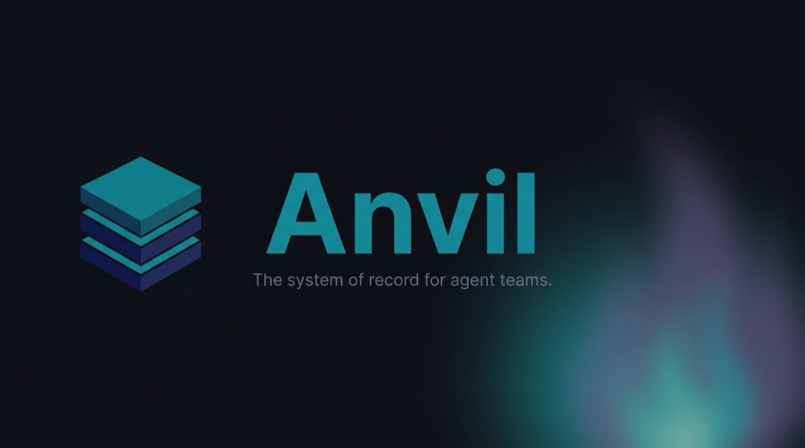

<div align="center">



# Anvil

**The system of record for agent teams** — durable, evidence-gated,
lease-coordinated state for multi-agent software work.

[](LICENSE)
[](.claude-plugin/plugin.json)
[](https://pypi.org/project/anvil-state/)
[](https://fakoli.github.io/anvil/)
[](tests)

</div>

---

Anvil is a local-first state layer that lets multiple AI coding agents — and
the humans working alongside them — execute the same plan without overwriting
each other. It records requirements, tasks, claims, and evidence in SQLite, and
exposes them through a CLI (`anvil`) and an MCP server that any harness (Claude
Code, Codex, Cursor, Copilot, …) can drive.

Two ideas separate it from an issue tracker:

- **Claims are enforced, not conventional.** A claim is a database row with a
  lease and heartbeat — single-winner coordination that holds across sessions,
  parallel loops, and machines, not "assign a label and hope."
- **Status is downstream of proof.** Completion is evidence-gated: agents submit
  typed proofs, reviews gate acceptance, and every accepted task mints a signed,
  replayable `AcceptanceProof` you can verify off-host.

> **Beta — v0.4.2.** The core loop is stable and dogfooded; some command
> surfaces may change before 1.0.

## Install

```bash
uv tool install anvil-state      # installs the `anvil` CLI + `anvil-mcp` server
anvil install <harness>          # wire anvil into Codex, Cursor, VS Code, …
```

Python 3.11+ and [uv](https://docs.astral.sh/uv/) are the only requirements.
Upgrading or uninstalling later? See
[Upgrading and uninstalling](https://fakoli.github.io/anvil/how-to/getting-started/#upgrading-and-uninstalling).

<details>
<summary>Other ways to install (Claude Code plugin · one-line script · from source)</summary>

**As a Claude Code plugin** — registers the hooks, MCP server, and agents:

```bash
/plugin marketplace add fakoli/anvil
/plugin install anvil@anvil
```

**One-line harness setup** (installs `anvil-state`, then runs `anvil install`):

```bash
curl -fsSL https://raw.githubusercontent.com/fakoli/anvil/main/scripts/install.sh | sh -s -- <harness>
```

**From source:**

```bash
git clone https://github.com/fakoli/anvil.git && cd anvil/bin
uv sync && uv run anvil --help
```

For MCP clients without an in-place writer, `anvil mcp-config <client>` prints a
paste-ready config block.

</details>

## Quick start

```bash
anvil init --with-sample     # seed a runnable sample project
anvil next                   # → the next ready task, immediately
anvil claim T001             # lease it; a git branch is created for the work
anvil packet T001            # the exact intent, acceptance criteria, and scope
anvil submit T001 --commands "pytest" --files-changed src/foo.py
anvil apply T001 --approve   # evidence-gated → done, with a signed proof
```

That is the whole loop. The
**[getting-started guide](https://fakoli.github.io/anvil/how-to/getting-started/)**
walks through it on your own PRD.

## What you get

- **A canonical plan, not free-form text.** PRDs parse into validated tasks
  scored across six dimensions (complexity, parallelizability, context load,
  blast radius, review risk, agent suitability) that drive routing.
- **Work packets built for agents.** `anvil packet T012` renders exact intent,
  acceptance criteria, and non-goals — no summarizing an issue thread.
- **A tamper-evident audit trail.** Every mutation appends to an event log;
  replaying it reconstructs the database — an invariant checked in CI.
- **Runtime-neutral by design.** The CLI and MCP server aren't coupled to any
  one agent runtime, and multi-PRD projects, GitHub Issues sync, and
  multi-provider LLM planning (Anthropic · Bedrock · OpenAI-compatible) all ship
  today.

## Anvil vs. an issue tracker

| | Anvil | GitHub Issues / markdown-file conventions |
|---|---|---|
| **State shape** | Pydantic models in SQLite, validated at every transition | Free-form markdown in an issue body or `.md` file |
| **Coordination** | `Claim` row with lease + heartbeat; stale leases reaped on every call | Assignment-by-label — no enforcement |
| **Agent hand-off** | Rendered work packet: intent, criteria, non-goals | Agent summarizes the whole thread |
| **Completion** | Evidence-gated; signed, replayable proof | Trust the "done" checkbox |
| **Context cost** | Measured ~2.4k always-on tokens ([audit](benchmarks/CONTEXT_AUDIT.md)) | Whole threads enter context on demand |

## Proven in real sessions

Numbers from recorded working sessions
([post-session-findings](https://github.com/fakoli/post-session-findings)), not
projections:

- **32 tasks, 21 PRs, and a release from one 23.7-hour autonomous session** —
  the loop stayed coherent across 28M generated tokens under ~2 dozen human
  messages.
- **Two concurrent agent loops finished an 18/18-task PRD in 16.7 hours** — the
  lease model deconflicted both sessions with zero explicit negotiation (in the
  [benchmark](benchmarks/RESULTS.md), file collisions dropped 3.0 → 0.0 vs. a
  shared-markdown control).
- **The review gates catch real defects every time they run** — a fail-open deny
  gate, log-injection bugs, and a semantically broken "clean" merge, each caught
  before it shipped.

## Documentation

Full documentation: **[fakoli.github.io/anvil](https://fakoli.github.io/anvil/)**

- [Getting started](https://fakoli.github.io/anvil/how-to/getting-started/) — first project, end to end
- [Using anvil on any harness](https://fakoli.github.io/anvil/how-to/using-anvil-on-any-harness/) — Cursor, VS Code, Zed, Codex, …
- [Architecture](https://fakoli.github.io/anvil/architecture/) · [CLI reference](https://fakoli.github.io/anvil/cli-reference/) · [MCP reference](https://fakoli.github.io/anvil/mcp/)
- [FAQ](https://fakoli.github.io/anvil/faq/) — installing, storage, backups, and common gotchas
- [Roadmap](https://fakoli.github.io/anvil/roadmap/) · [CHANGELOG](CHANGELOG.md)

## Status

Beta (v0.4.2). The full PRD → plan → claim → execute → verify → finish loop
works today, alongside GitHub Issues sync and multi-provider LLM support.
Near-term focus is correctness for claim races, evidence gates, and replay;
Linear/Monday providers and webhook sync are on the
[roadmap](https://fakoli.github.io/anvil/roadmap/).

## License

MIT — see [LICENSE](LICENSE). Built by Sekou Doumbouya
([@fakoli](https://github.com/fakoli)).
