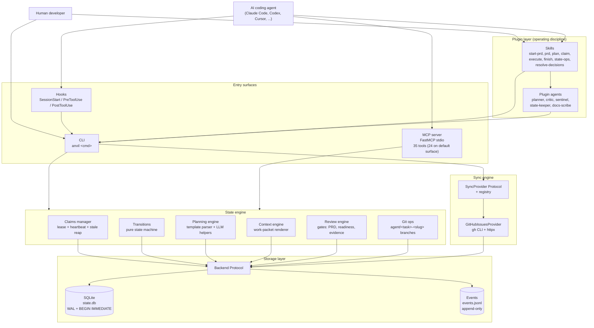
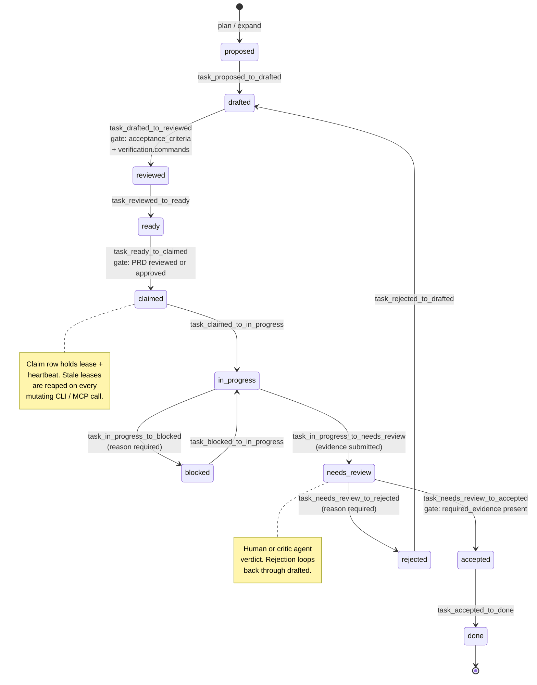

# anvil architecture

> Condensed reference for the current **v0.5.0** standalone state. For the original v0
> vision and aspirational items, see
> [`specs/2026-05-24-anvil-v0.md`](specs/2026-05-24-anvil-v0.md).
> For what is planned but not yet shipped, see
> [`roadmap.md`](roadmap.md).
>
> This document is intentionally short — readable in ten minutes — and
> describes only what exists on disk today. Every entity, command, tool, and
> hook listed here has a file pointer; if it isn't pointed at, it doesn't
> ship.

---

## Mental model

anvil is to agentic software work what Terraform is to infrastructure:
a canonical state file holds the project record, derived views (work packets, markdown
plans, dependency graphs) are projected from it, and the plan-then-apply
rhythm gates execution behind review. The PRD is the configuration; the
SQLite database is the state; `anvil apply` is the commit point that
records evidence and transitions a task to `done`. Drift (stale claims,
orphan branches, sync conflicts) is detected and reconciled, not papered
over.

A single project holds **several release-scoped PRDs** in one `state.db` and one
`events.jsonl`. Each PRD is a separately-gated, revisable plan that carries a
target version/tag (a release or milestone); its requirements, features, and
tasks are partitioned by an owning `prd_id`. The single-PRD project is just the
degenerate case — one `default` PRD owning every row. Because each PRD gates
independently, the `prd_status_gate` keys on the **task's owning PRD**: a task is
claimable as soon as *its* PRD is reviewed/approved, even while a sibling PRD is
still `draft`. Conflict detection, by contrast, spans **all** PRDs — two tasks in
different PRDs that touch the same file land in one conflict group, so the
single-winner guarantee holds across the whole project, not per-PRD. See
[`_positioning.md`](_positioning.md) for the per-PRD-as-scoped-stack framing.

The full positioning (the five differentiators and the Terraform analogy) is maintained
in [`_positioning.md`](_positioning.md); this document does not duplicate
that material.

---

## Component layers



Source: [`assets/diagrams/component.mmd`](https://github.com/fakoli/anvil/blob/main/assets/diagrams/component.mmd).

<div align="center">

</div>

### Per-layer responsibilities

| Layer | What it owns | Key files |
|---|---|---|
| Plugin manifest | Discoverability, version, keywords | [`.claude-plugin/plugin.json`](https://github.com/fakoli/anvil/blob/main/.claude-plugin/plugin.json) |
| CLI | Pure state operations — CRUD, scoring, packet generation, sync. No workflow choreography. | [`bin/src/anvil/cli/__init__.py`](https://github.com/fakoli/anvil/blob/main/bin/src/anvil/cli/__init__.py) |
| MCP server | Runtime-neutral capability surface — 35 registered stdio tools; the default execution surface serves 24 on the wire, and the 11 planning-tagged tools require `ANVIL_MCP_PLANNING=1` | [`bin/src/anvil/mcp_server.py`](https://github.com/fakoli/anvil/blob/main/bin/src/anvil/mcp_server.py) |
| Hooks | Non-blocking enforcement the model would otherwise forget | [`hooks/hooks.json`](https://github.com/fakoli/anvil/blob/main/hooks/hooks.json), [`hooks/*.sh`](https://github.com/fakoli/anvil/tree/main/hooks) |
| Skills | Workflow choreography — one-question-at-a-time, propose approaches, gate transitions | [`skills/*/SKILL.md`](https://github.com/fakoli/anvil/tree/main/skills) |
| Plugin agents | Specialist roles owned by this plugin | [`agents/*.md`](https://github.com/fakoli/anvil/tree/main/agents) |
| Backend protocol | The seam between state-engine logic and storage; SqliteBackend is the only impl that ships | [`bin/src/anvil/state/backend.py`](https://github.com/fakoli/anvil/blob/main/bin/src/anvil/state/backend.py), [`bin/src/anvil/state/sqlite.py`](https://github.com/fakoli/anvil/blob/main/bin/src/anvil/state/sqlite.py) |
| Transitions | Pure state machine — no I/O, no DB, no side-effects beyond `model_copy()` | [`bin/src/anvil/state/transitions.py`](https://github.com/fakoli/anvil/blob/main/bin/src/anvil/state/transitions.py) |
| Claims manager | Atomic lease + heartbeat; stale detection on every operation | [`bin/src/anvil/claims/manager.py`](https://github.com/fakoli/anvil/blob/main/bin/src/anvil/claims/manager.py), [`bin/src/anvil/claims/stale.py`](https://github.com/fakoli/anvil/blob/main/bin/src/anvil/claims/stale.py) |
| Planning engine | Template-first PRD parser; optional LLM augmentation; deterministic six-dim scorer | [`bin/src/anvil/planning/`](https://github.com/fakoli/anvil/tree/main/bin/src/anvil/planning) |
| Context engine | Renders work packets (markdown + JSON) from canonical state | [`bin/src/anvil/context/packets.py`](https://github.com/fakoli/anvil/blob/main/bin/src/anvil/context/packets.py) |
| Review engine | Pure transition-gate functions (readiness, evidence) | [`bin/src/anvil/review/gates.py`](https://github.com/fakoli/anvil/blob/main/bin/src/anvil/review/gates.py) |
| Git ops | Auto-create `agent/<task>-<slug>` branch on `claim`; optional worktree | [`bin/src/anvil/git_ops/`](https://github.com/fakoli/anvil/tree/main/bin/src/anvil/git_ops) |
| Sync engine | Bidirectional GitHub Issues projection via the `SyncProvider` Protocol | [`bin/src/anvil/sync/`](https://github.com/fakoli/anvil/tree/main/bin/src/anvil/sync) |

The two iron rules of the layering:

1. **CLI is the one-and-only mutator.** Hooks shell out to the CLI; the MCP
   server opens a `SqliteBackend` directly but only via the same engine
   functions the CLI uses. Skills and agents do not write to `.anvil/`
   directly — they call the CLI.
2. **Transitions are pure.** Every status change is a function from
   `(entity, context) -> new entity`. Persisting the result is the backend's
   job, not the transition's. This is what makes the JSONL replay possible.

---

## Data model

The full type system lives in
[`bin/src/anvil/state/models.py`](https://github.com/fakoli/anvil/blob/main/bin/src/anvil/state/models.py)
— **35 Pydantic v2 classes** total (13 enums + 22 models). Every field is
validated at every transition (`extra="forbid"`,
`validate_assignment=True`); all timestamps are UTC-required. The tables
below cover the core set; the newer `TaskType` / `ProofKind` enums and the
proof models (`CommandProof`, `DiffProof`, `LinkProof`, `AssertionProof`,
`ProofRequirement`), `EventRange`, `AcceptanceProof`, and `EventDraft` are
not yet tabled.

### Enums (11)

| Enum | Values | Purpose |
|---|---|---|
| `PRDStatus` | draft, reviewed, approved, rejected | Gates task claimability |
| `FeatureStatus` | proposed, ready, in_progress, done | Coarse-grain status on a Feature |
| `TaskStatus` | proposed, drafted, reviewed, ready, claimed, in_progress, blocked, needs_review, accepted, done, rejected | The 11-status task lifecycle (see [Task lifecycle](#task-lifecycle)) |
| `TaskPriority` | low, medium, high, critical | Sort key for `anvil next` |
| `ClaimType` | task, feature, file_scope, exploratory | Distinguishes whole-task vs partial leases |
| `ClaimStatus` | active, released, stale, force_released | Lease lifecycle |
| `ReviewTargetKind` | prd, task, feature | What a `Review` row points at |
| `ReviewDecision` | approve, reject, needs_changes | Reviewer verdict |
| `ExternalSystem` | github_issues | Canonical first-party provider ids (extensible via registry) |
| `SyncState` | in_sync, local_ahead, remote_ahead, conflict, external_deleted, remote_unknown | Per-mapping conflict / health label |
| `ConflictResolutionStrategy` | local_wins, remote_wins, prompt, manual_merge | How to resolve a divergence |

### Embedded value objects (2)

| Model | Purpose |
|---|---|
| `Score` | Six-dimension scoring on a Task: complexity, parallelizability, context_load, blast_radius, review_risk, agent_suitability (each 1-5 or null) |
| `Verification` | Embedded on Task: `commands`, `manual_steps`, `required_evidence` — the contract the evidence gate checks against |

### Top-level entities (12)

| Entity | Purpose |
|---|---|
| `Project` | Root entity that owns all other entities in the database — including **several PRDs** |
| `PRD` | A release/milestone-scoped, separately-gated, revisable plan carrying a target version/tag; gates claimability of the tasks it owns. A project holds one or more PRDs (a `default` PRD plus any named release PRDs), all in the same `state.db`/`events.jsonl` |
| `Requirement` | A single atomic requirement derived from a section of a PRD; partitioned by its owning `prd_id` |
| `Feature` | A logical grouping of tasks that delivers a user-observable capability; partitioned by `prd_id` |
| `Task` | The primary unit of work — claimable, scoreable, evidence-backed; carries the owning `prd_id` that its claim gate keys on |
| `Claim` | An exclusive lease that an agent holds on a Task while working on it |
| `Evidence` | Completion evidence submitted by an agent after finishing a Task |
| `Decision` | An architectural or design decision recorded for audit and context |
| `Review` | A human or agent review verdict on a PRD, Task, or Feature |
| `Event` | An immutable append-only log entry; monotonic id `E000001`, `E000002`, ... |
| `SyncMapping` | Tracks a Task's relationship to an issue in an external system |
| `ConflictGroup` | A named set of tasks whose `expected_files` overlap |

Type aliases (`TaskID`, `FeatureID`, `RequirementID`, `ClaimID`, `EvidenceID`,
`DecisionID`, `ReviewID`, `EventID`) are plain `str` newtypes — no runtime
overhead but grep-able at every call site.

The shared model config on every entity:

```python
_MODEL_CONFIG = ConfigDict(
    frozen=False,             # mutable for state transitions
    validate_assignment=True, # but assignment-validated end-to-end
    extra="forbid",           # unknown fields are an error
)
```

---

## Task lifecycle



Source: [`assets/diagrams/lifecycle.mmd`](https://github.com/fakoli/anvil/blob/main/assets/diagrams/lifecycle.mmd).

> Note: the evidence gate on `needs_review → accepted` is computed and
> reported at apply time but **enforced** only when `strict_evidence`
> resolves true; the default path approves regardless.

All 11 statuses are defined in `TaskStatus` and the allowed transitions are
the public functions in
[`bin/src/anvil/state/transitions.py`](https://github.com/fakoli/anvil/blob/main/bin/src/anvil/state/transitions.py).
The module is pure (no I/O); each function returns a new `Task` via
`model_copy(update=...)`.

### Gates on the lifecycle

Three named gates appear in the transition module; each raises
`TransitionError(gate_name=...)` with a structured error envelope:

| Gate | Where it fires | What it checks |
|---|---|---|
| `readiness_gate` | drafted → reviewed | `task.acceptance_criteria` and `task.verification.commands` must both be non-empty |
| `prd_status_gate` | ready → claimed | The task's **owning** PRD (resolved via `task.prd_id`) must be in `reviewed` or `approved` (refuses while `draft`). A task in an approved PRD is claimable while a sibling in a draft PRD is refused |
| `evidence_gate` | needs_review → accepted | Every item in `task.verification.required_evidence` must appear as a substring of at least one Evidence field. Computed and reported at apply time, but enforced only when `strict_evidence` resolves true — the default path approves regardless |

### Who drives each transition

| Transition | Typical driver | CLI verb |
|---|---|---|
| proposed → drafted → reviewed → ready | Planner agent or human via `plan` / `review` | `anvil plan`, `anvil review tasks` |
| ready → claimed | Coding agent (or human) | `anvil claim T012` |
| claimed → in_progress | Auto on first heartbeat or file change | (implicit) |
| in_progress ↔ blocked | Agent or human | `anvil hook ... block` |
| in_progress → needs_review | Coding agent submitting evidence | `anvil submit T012 ...` |
| needs_review → accepted or rejected | Human reviewer or critic agent | `anvil apply T012 --approve` / `--reject` |
| accepted → done | Auto on `apply --approve` | (implicit) |
| rejected → drafted | Author revises and re-submits | `anvil plan` (re-edit) |

Only `drafted ↔ ready` and the `blocked` toggle are exposed via the
`update_task_status` MCP tool; all other transitions require a more
specific CLI verb (claim, submit, apply) so that the necessary
side-effects (lease creation, evidence write, claim release) happen
atomically.

---

## Event log and JSONL replay

Every state mutation appends one `Event` row to two places:

1. The `events` table inside `state.db` (assigned the monotonic id
   `E000001`, `E000002`, ... inside the same `BEGIN IMMEDIATE`
   transaction that mutated state).
2. `events.jsonl` — a newline-delimited JSON mirror, append-only, written
   after the SQLite commit succeeds.

The replay guarantee is the central audit property of the engine: **replaying
`events.jsonl` from an empty database must reconstruct canonical SQLite state
exactly**. This is what makes the engine safe to back up by copying
`.anvil/` and what makes a corrupted database recoverable.

A native `anvil replay --from-events <jsonl> --into <db>` subcommand
**ships today**
([`bin/src/anvil/cli/replay.py`](https://github.com/fakoli/anvil/blob/main/bin/src/anvil/cli/replay.py) — it
refuses to target the live database) and rebuilds state from the event
log; a CI equivalence test
([`tests/test_replay_equivalence.py`](https://github.com/fakoli/anvil/blob/main/tests/test_replay_equivalence.py))
verifies the guarantee. `anvil backup` / `anvil restore` also ship —
S3 push/pull of `events.jsonl` plus a replay-based restore. Only the
`anvil snapshot` subcommand (item P9B-7, a local sqlite `.backup`
wrapper — see
[`roadmap.md` § Snapshot / replay](roadmap.md#theme-snapshot-replay))
remains open. Copying `.anvil/` wholesale stays as the fully-local
fallback; the replay guarantee makes that safe and minimal:

```bash
# Back up before destructive work.
cp -r .anvil /backup/location/anvil-$(date +%Y-%m-%d)

# Recover from a corrupted state.db by restoring the backup.
rm -f .anvil/state.db .anvil/state.db-wal .anvil/state.db-shm
cp /backup/location/anvil-YYYY-MM-DD/state.db .anvil/state.db
```

`events.jsonl` is the durable audit log even without replay tooling —
commit it to git alongside the repo and you have a distributed audit
trail recoverable from any clone.

Event ids are assigned inside the lock, not before it, to eliminate a
read-before-lock race surfaced in PR #41 (Critic-3). The `Event.id`
validator accepts a `"PENDING"` sentinel so callers can defer id
assignment to the backend's `apply_event` method.

---

## Storage layout

`anvil init` scaffolds this layout inside the user's project root
(not inside the plugin):

```text
<user-project>/.anvil/
├── config.yaml         # project-level config (sync providers, lease defaults, ...)
├── state.db            # SQLite — the canonical state for ALL PRDs (WAL mode)
├── events.jsonl        # append-only audit / event log for ALL PRDs (replay source)
├── prd.md              # the default PRD source (edited by hand; `prd parse`)
├── prds/               # named release-scoped PRD sources
│   ├── v0.2.md         #   .anvil/prds/<prd_id>.md — one file per named PRD
│   └── v0.3.md
└── packets/            # generated work packets (per-task markdown / json)
```

One state.db and one events.jsonl hold **every** PRD's rows, partitioned by
`prd_id`; there is no per-PRD database. The default PRD keeps its source at the
bare `.anvil/prd.md`; each named release PRD has a markdown source at
`.anvil/prds/<prd_id>.md` (resolved by `prd_source_path()` —
[`cli/_helpers.py`](https://github.com/fakoli/anvil/blob/main/bin/src/anvil/cli/_helpers.py)). Re-parsing one PRD
replaces only that PRD's rows and leaves the others untouched.

A `snapshots/` subdirectory was originally planned (and is shown in the v0
spec) but the `anvil snapshot` subcommand has not yet shipped — see
[Roadmap → v2.1 → snapshot subcommand](roadmap.md#theme-snapshot-replay).
Backups today are done with `anvil backup` / `anvil restore` (S3 push/pull
of `events.jsonl` plus a replay-based restore) or by copying `.anvil/`
wholesale (`cp -R`); the replay guarantee makes that safe.

`hooks` and the CLI alike resolve `STATE_DIR` relative to
`${CLAUDE_PROJECT_DIR:-$PWD}/.anvil` so every agent invocation,
regardless of cwd at call time, addresses the same project's state.

---

## Concurrency model

Multiple humans and multiple agents must coordinate on the same canonical
state without overlapping each other's work. anvil achieves this with four
mechanisms layered together:

1. **SQLite WAL + `BEGIN IMMEDIATE`.** Every mutating operation runs inside
   an immediate-mode transaction, so concurrent writers serialize at the
   SQLite layer. Reads use WAL snapshots and do not block writers.
2. **Claim leases with heartbeats.** A `Claim` row carries
   `lease_expires_at` and `last_heartbeat_at`. The CLI's `renew` command
   (and the MCP `renew_claim` tool) extends the lease. Default lease is 240
   minutes (configurable via `.anvil/config.yaml`); the in-code
   default lives at [`claims/manager.py`](https://github.com/fakoli/anvil/blob/main/bin/src/anvil/claims/manager.py).
3. **Stale-claim reaping.** Every mutating CLI command and every mutating
   MCP tool calls
   [`detect_and_release_stale()`](https://github.com/fakoli/anvil/blob/main/bin/src/anvil/claims/stale.py)
   at entry. Leases past their expiry are auto-released with
   `release_reason="stale"`; the audit event preserves the original
   claimant. Read-only listers skip reaping for latency.
4. **Conflict groups.** A `ConflictGroup` row names a set of tasks whose
   `expected_files` overlap. `anvil next` and the
   `get_next_task` MCP tool refuse to surface a task whose conflict group
   already has an active claim — preventing two agents from being routed
   to overlapping work even when neither task is itself claimed.

The PreToolUse `check-claim.sh` hook adds a final layer of safety at the
Claude Code editor surface: before an Edit / Write / NotebookEdit fires,
the hook asks the CLI whether the current actor holds a claim covering the
target file, and surfaces a warning (non-blocking, per the hook contract)
when no claim is held.

---

## CLI / MCP / hooks surface

### CLI commands

Full reference is available at
[`docs/cli-reference.md`](cli-reference.md). The command surface assembled
in [`bin/src/anvil/cli/__init__.py`](https://github.com/fakoli/anvil/blob/main/bin/src/anvil/cli/__init__.py):

- Lifecycle setup and inspection: `init`, `status`, `describe`, `doctor`
- PRD authoring: `prd parse`, `prd review` (sub-app)
- Planning: `plan`, `score`, `assumptions`, `expand`, `deps`, `review tasks` (sub-app)
- Listing / inspecting: `list`, `show`, `scan`, `drift`, `graph`, `conflicts`
- Claiming: `claim`, `release`, `renew`, `next`, `claim-guard`
- Working: `packet`, `submit`, `apply`, `gate-check`, `run-workflow`, `proof` (sub-app — `proof verify`)
- Notifications: `notify-digest`
- Harness config: `mcp-config`, `install`
- Backup / restore: `backup`, `restore`
- Migration / replay: `migrate state`, `migrate-events`, `migrate-workspace`, `replay`
- Hooks: `hook ...` (sub-app — called by `hooks/*.sh`)
- Sync: `sync ...` (sub-app — `sync github`, `sync github --health`, ...)

### MCP tools (35)

Full reference is at [`docs/mcp.md`](mcp.md). Source:
[`bin/src/anvil/mcp_server.py`](https://github.com/fakoli/anvil/blob/main/bin/src/anvil/mcp_server.py).

All 35 tools are registered, but the default execution surface serves 24
on the wire; the 11 planning-tagged tools (`parse_prd`, `plan_tasks`,
`score_tasks`, ...) require `ANVIL_MCP_PLANNING=1` (`mcp_server.py`
tag-disables them at startup).

| # | Tool | Mutates | Reaps stale |
|---|---|---|---|
| 1 | `get_project_summary` | no | yes |
| 2 | `get_project_status` | no | no |
| 3 | `list_tasks` | no | no |
| 4 | `get_task` | no | no |
| 5 | `get_next_task` | no | no |
| 6 | `get_dependency_graph` | no | no |
| 7 | `claim_task` | yes | yes |
| 8 | `release_task` | yes | yes |
| 9 | `renew_claim` | yes | yes |
| 10 | `update_task_status` | yes | yes |
| 11 | `submit_progress` | yes (audit-only) | yes |
| 12 | `submit_completion_evidence` | yes | yes |
| 13 | `generate_work_packet` | no | no |
| 14 | `check_conflicts` | no | no |
| 15 | `edit_dependencies` | yes | no |
| 16 | `init_project` | yes | no |
| 17 | `parse_prd` | yes | no |
| 18 | `review_prd` | yes | no |
| 19 | `plan_tasks` | yes | no |
| 20 | `score_tasks` | yes | no |
| 21 | `review_tasks` | yes | no |
| 22 | `apply_review_decision` | yes | no |
| 23 | `find_decisions` | no | no |
| 24 | `describe_surface` | no | no |

Sync tools (`sync_run`, `sync_health`, `sync_status`, `sync_reconcile`) are
not yet on the MCP surface — agents that want sync today shell out via Bash
to `anvil sync`. See
[Roadmap → v2.1 → MCP sync tools](roadmap.md#theme-mcp-surface-sync-tools).

### Hooks (5)

Wired in [`hooks/hooks.json`](https://github.com/fakoli/anvil/blob/main/hooks/hooks.json).
The manifest calls the shell-free `anvil hook dispatch <name>` path via `uv run
--quiet --project ...`, so Codex on Windows never depends on a bare `bash`.
The legacy shell scripts remain as compatibility/test wrappers. All five hooks are
**non-blocking**: they must `exit 0` regardless of internal failure and must complete
in well under their declared timeout.

| Hook | Trigger | Script | Purpose |
|---|---|---|---|
| `detect-state` | SessionStart | `anvil hook dispatch detect-state` / [`detect-state.sh`](https://github.com/fakoli/anvil/blob/main/hooks/detect-state.sh) | Surface project state info into the session context |
| `check-claim` | PreToolUse on `Edit / Write / NotebookEdit` | `anvil hook dispatch check-claim` / [`check-claim.sh`](https://github.com/fakoli/anvil/blob/main/hooks/check-claim.sh) | Warn (non-blocking) if the agent has no active claim covering the file |
| `record-file-change` | PostToolUse on `Edit / Write / NotebookEdit` | `anvil hook dispatch record-file-change` / [`record-file-change.sh`](https://github.com/fakoli/anvil/blob/main/hooks/record-file-change.sh) | Record the change against the active claim for orphan detection |
| `capture-evidence` | PostToolUse on `Bash` | `anvil hook dispatch capture-evidence` / [`capture-evidence.sh`](https://github.com/fakoli/anvil/blob/main/hooks/capture-evidence.sh) | When the command matches a verification pattern, buffer it as evidence for the active claim |
| `heartbeat` | PostToolUse on `Edit / Write / NotebookEdit` and on `Bash` | `anvil hook dispatch heartbeat` / [`heartbeat.sh`](https://github.com/fakoli/anvil/blob/main/hooks/heartbeat.sh) | Renew the active claim's lease |

### Skills (8)

Workflow choreography lives in [`skills/*/SKILL.md`](https://github.com/fakoli/anvil/tree/main/skills) —
start-prd, prd, plan, claim, execute, finish, state-ops, resolve-decisions.

Skill frontmatter is always loaded into the model's context (it is the
plugin's command surface), so the combined skill footprint is kept under an
explicit token budget enforced in CI — see
[`context-budget.md`](context-budget.md) and
[`tests/test_token_budget.py`](https://github.com/fakoli/anvil/blob/main/tests/test_token_budget.py).

### Plugin agents (5)

Defined in [`agents/*.md`](https://github.com/fakoli/anvil/tree/main/agents):

- `planner` — drafts feature / task decomposition from a parsed PRD
- `critic` — reviews PRD or task drafts; produces an approve / reject / needs_changes verdict
- `sentinel` — pre-merge verification
- `state-keeper` — operational hygiene: orphan claims, drift, schema migrations
- `docs-scribe` — keeps `docs/` synchronised with shipped behaviour

Each agent's frontmatter pins `tools:` (least privilege).

---

## Where to read the code

Map from architectural layer to source file. Every layer of this document
points at a file you can grep.

| Layer | File(s) |
|---|---|
| Entry: CLI assembly | [`bin/src/anvil/cli/__init__.py`](https://github.com/fakoli/anvil/blob/main/bin/src/anvil/cli/__init__.py) |
| Entry: MCP server (35 tools) | [`bin/src/anvil/mcp_server.py`](https://github.com/fakoli/anvil/blob/main/bin/src/anvil/mcp_server.py) |
| Entry: hooks manifest | [`hooks/hooks.json`](https://github.com/fakoli/anvil/blob/main/hooks/hooks.json) |
| Type system | [`bin/src/anvil/state/models.py`](https://github.com/fakoli/anvil/blob/main/bin/src/anvil/state/models.py) |
| Transitions (pure) | [`bin/src/anvil/state/transitions.py`](https://github.com/fakoli/anvil/blob/main/bin/src/anvil/state/transitions.py) |
| Backend Protocol | [`bin/src/anvil/state/backend.py`](https://github.com/fakoli/anvil/blob/main/bin/src/anvil/state/backend.py) |
| SQLite impl + schema | [`bin/src/anvil/state/sqlite.py`](https://github.com/fakoli/anvil/blob/main/bin/src/anvil/state/sqlite.py), [`schema.py`](https://github.com/fakoli/anvil/blob/main/bin/src/anvil/state/schema.py) |
| Event payloads | [`bin/src/anvil/state/payloads.py`](https://github.com/fakoli/anvil/blob/main/bin/src/anvil/state/payloads.py) |
| Canonical-state snapshot (replay-equivalence) | [`bin/src/anvil/state/snapshot.py`](https://github.com/fakoli/anvil/blob/main/bin/src/anvil/state/snapshot.py) |
| Hash-chained event ids (git-backed events) | [`bin/src/anvil/state/hashing.py`](https://github.com/fakoli/anvil/blob/main/bin/src/anvil/state/hashing.py) |
| Durable storage seam (push/pull `events.jsonl` to a remote store) | [`bin/src/anvil/state/durable.py`](https://github.com/fakoli/anvil/blob/main/bin/src/anvil/state/durable.py) |
| Per-PRD status rollup | [`bin/src/anvil/state/rollup.py`](https://github.com/fakoli/anvil/blob/main/bin/src/anvil/state/rollup.py) |
| Claims manager | [`bin/src/anvil/claims/manager.py`](https://github.com/fakoli/anvil/blob/main/bin/src/anvil/claims/manager.py) |
| Stale reaping | [`bin/src/anvil/claims/stale.py`](https://github.com/fakoli/anvil/blob/main/bin/src/anvil/claims/stale.py) |
| Planning (template + LLM + scoring) | [`bin/src/anvil/planning/`](https://github.com/fakoli/anvil/tree/main/bin/src/anvil/planning) |
| Context (work packets) | [`bin/src/anvil/context/packets.py`](https://github.com/fakoli/anvil/blob/main/bin/src/anvil/context/packets.py) |
| Review gates | [`bin/src/anvil/review/gates.py`](https://github.com/fakoli/anvil/blob/main/bin/src/anvil/review/gates.py) |
| Git ops | [`bin/src/anvil/git_ops/`](https://github.com/fakoli/anvil/tree/main/bin/src/anvil/git_ops) |
| Brownfield scan / ingest (`.anvil/scan.db` → draft PRD + task graph) | [`bin/src/anvil/scan/`](https://github.com/fakoli/anvil/tree/main/bin/src/anvil/scan) |
| Declarative workflows (`.anvil/workflows/*.yaml` parse + run) | [`bin/src/anvil/workflows/`](https://github.com/fakoli/anvil/tree/main/bin/src/anvil/workflows) |
| Ed25519 proof signing | [`bin/src/anvil/signing.py`](https://github.com/fakoli/anvil/blob/main/bin/src/anvil/signing.py) |
| Task-id → safe path/branch component | [`bin/src/anvil/naming.py`](https://github.com/fakoli/anvil/blob/main/bin/src/anvil/naming.py) |
| Sync Protocol + registry | [`bin/src/anvil/sync/provider.py`](https://github.com/fakoli/anvil/blob/main/bin/src/anvil/sync/provider.py), [`registry.py`](https://github.com/fakoli/anvil/blob/main/bin/src/anvil/sync/registry.py) |
| GitHub provider | [`bin/src/anvil/sync/providers/github_issues.py`](https://github.com/fakoli/anvil/blob/main/bin/src/anvil/sync/providers/github_issues.py) |
| Reconciliation | [`bin/src/anvil/sync/reconciliation.py`](https://github.com/fakoli/anvil/blob/main/bin/src/anvil/sync/reconciliation.py) |
| Plugin config | [`bin/src/anvil/config.py`](https://github.com/fakoli/anvil/blob/main/bin/src/anvil/config.py) |
| Clock abstraction | [`bin/src/anvil/clock.py`](https://github.com/fakoli/anvil/blob/main/bin/src/anvil/clock.py) |

---

## What is NOT here yet

This document describes the current shipped behaviour only. The full backlog of
planned-but-not-yet-shipped items is in [`roadmap.md`](roadmap.md);
the high-level buckets:

- **v2.0 — sync providers + immediate-apply resolution.**
  - `LinearIssuesProvider` (GraphQL transport).
  - `MondayBoardsProvider` (REST + JSON, people-columns).
  - Webhook-based sync as an alternative to polling (spec-first).
  - `*_applied` conflict-resolution variants — wiring the
    `remote_wins_applied` / `local_wins_applied` deferrals at
    `cli/sync.py:1054, :1068`.
  - Provider config schemas in `config.yaml` (per-provider settings).
- **v2.1 — follow-on capability.**
  - `JiraIssuesProvider` (per-project workflow discovery).
  - `GitHubProjectsProvider` (Projects v2 board surface).
  - `anvil snapshot` subcommand (`sqlite3 .backup` wrapper, retention).
  - MCP sync surface — four new tools (`sync_run`, `sync_health`,
    `sync_status`, `sync_reconcile`).
- **v2.x — hygiene.**
  - Composition deduplication across the three doc/state agents.
  - Skill subdirectory extraction (`references/`, `examples/`, `scripts/`).
  - Hook concurrency hardening (`flock` on shared append targets).
- **Unscheduled.**
  - Config-driven matcher framework for `capture-evidence.sh`.

Each item carries a backlog id (`P9B-N` from the Phase 9 backlog or
`P11-XX-XN` from the Phase 11 backlog) preserved across audits — see
[`roadmap.md`](roadmap.md) for per-item acceptance criteria, file pointers,
and welder-effort estimates.

---

## Further reading

- [`_positioning.md`](_positioning.md) — differentiators and the Terraform analogy (internal positioning reference)
- [`specs/2026-05-24-anvil-v0.md`](specs/2026-05-24-anvil-v0.md) — the original 358-line v0 build spec (this document is its condensed shipped sibling)
- [`mcp.md`](mcp.md) — full 35-tool MCP reference with error envelope contract
- [`github-sync.md`](github-sync.md) — bidirectional GitHub Issues sync reference
- [`sync-providers.md`](sync-providers.md) — contributor guide for new sync providers
- [`prd-template.md`](prd-template.md) — PRD authoring schema and worked example
- [`llm.md`](llm.md) — `--use-llm` augmentation, prompt caching, `RecordedLLMProvider` test pattern
- [`roadmap.md`](roadmap.md) — what is planned next
