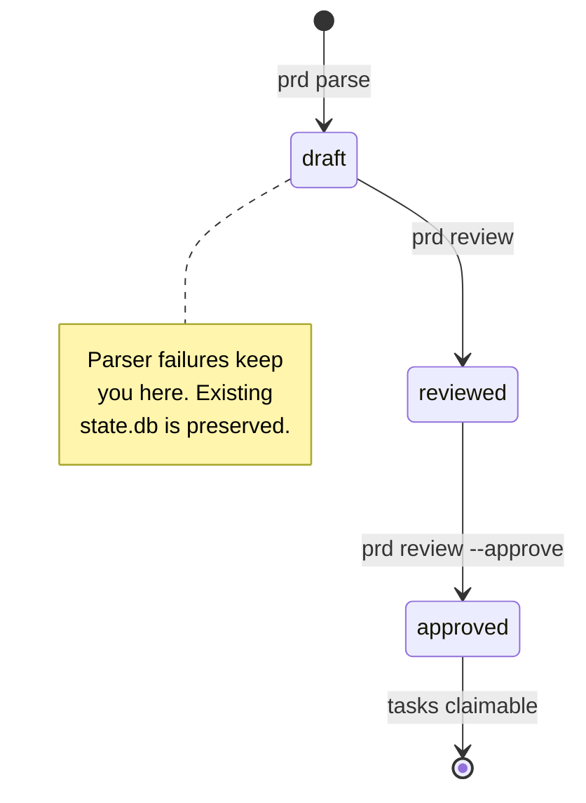

# Authoring a PRD

> The PRD is the canonical source of truth for what gets built. Get the structure right
> and the deterministic parser does the rest — requirements, features, and tasks all
> derive from one markdown file.

This guide assumes you have already run `anvil init` (which creates the `.anvil/`
directory but does NOT auto-create `prd.md`) and are ready to author `.anvil/prd.md`
by hand. For the canonical schema, see
[`../prd-template.md`](../prd-template.md). For an end-to-end first run, see
[getting-started.md](getting-started.md).

Wherever this guide writes `.anvil/...`, it means the resolved state dir, by
default under `~/.anvil/workspaces/...` — see
[getting-started.md → Where your state lives](getting-started.md#where-your-state-lives)
for the exact layout and how to override it.

New to terms like requirement, feature, or task in this context? See the
[glossary](../glossary.md).

---

## The PRD lifecycle

Three statuses, two gates, one source file:

| Status     | Meaning                                                                 |
|------------|-------------------------------------------------------------------------|
| `draft`    | The file exists; either never parsed or just re-parsed. No tasks claimable. |
| `reviewed` | `prd parse` succeeded and you ran `prd review`. Still not claimable.    |
| `approved` | `prd review --approve` ran. Tasks in `ready` status can now be claimed. |



The `prd_status_gate` in
[`state/transitions.py`](https://github.com/fakoli/anvil/blob/main/bin/src/anvil/state/transitions.py) enforces the
final hop: `ready → claimed` refuses while the PRD is still `draft`. The
gate accepts both `reviewed` and `approved` — see
[architecture.md → Gates on the lifecycle](../architecture.md#gates-on-the-lifecycle).)

---

## The template contract

The full schema lives in [`../prd-template.md`](../prd-template.md). The deterministic
parser at
[`planning/template.py`](https://github.com/fakoli/anvil/blob/main/bin/src/anvil/planning/template.py) extracts these
sections in this order:

| Section                | Required | Stored as                  |
|------------------------|----------|----------------------------|
| `# Project: <Name>`    | yes      | Project display name       |
| `## Summary`           | yes      | `PRD.summary` (string)     |
| `## Goals`             | yes      | `PRD.goals` (list)         |
| `## Non-Goals`         | no       | `PRD.non_goals` (list) — keeps scope tight |
| `## Requirements`      | yes      | `Requirement` rows (R001, R002, …) |
| `## Acceptance Criteria` | no     | `PRD.acceptance_criteria` (list) |
| `## Risks`             | no       | `PRD.risks` (list)         |
| `## Open Questions`    | no       | `PRD.open_questions` (list) |
| `## Assumptions`       | no       | Typed `PRD.assumptions` records: stable ID, statement, rationale, optional requirement references |
| `## Features`          | no       | `Feature` rows (F001, F002, …) |
| `## Tasks`             | no       | `Task` rows (T001, T002, …) |

A missing required section produces a `ParseError` and the existing `state.db` is
preserved untouched. A missing optional section silently defaults to an empty list and
parsing continues.

## Behaviour-first readiness (advisory)

Run `anvil prd assess` after drafting to get a deterministic, read-only view of
whether the PRD makes the intended user behaviour testable before design starts.
It reports location-aware suggestions for missing user context, outcomes, scope
or risk boundaries, observable acceptance criteria, failure behaviour, and task
verification. EARS and Gherkin-shaped criteria are recognised as useful input;
free-form criteria remain valid and receive guidance rather than rejection.

The assessment does not change the lifecycle: it never blocks parse, review,
approval, planning, or claims. With `--json`, it emits the normal Anvil envelope
for scripts and agents. See the [PRD template](../prd-template.md#assumptions)
for the typed assumptions format that carries documented autonomous defaults
into planner context and affected work packets.

Typed assumption IDs are bounded to 32 ASCII characters. Assumptions are
bounded to 100 records per PRD, 500 characters per
statement, 1,000 characters per rationale, and 100 requirement references per
record. Revising an assumption returns an approved PRD to `draft` for review.
They are separate from `anvil assumptions`, the read-only command that ranks
requirement uncertainty.

**Provide IDs explicitly.** Auto-assigned IDs shift when you insert a new bullet above
an existing one, breaking every cross-reference. Write `- R001: ...` not just `- ...`.

---

## A real-ish example

Here's the shape of a real PRD — a trimmed fragment, not the full file. For a
complete, copy-pasteable example with every required and optional section
filled in, see the PRD template's
[Quick-Start Example](../prd-template.md#quick-start-example) — that is the
canonical one to start from.

> **Multi-PRD note.** `.anvil/prd.md` is the **default** PRD's source (conceptually
> `.anvil/prds/default.md`). A project can hold several release-scoped PRDs in one
> `state.db`; a named one lives at `.anvil/prds/<prd_id>.md`, is parsed with
> `anvil prd parse --prd <prd_id>`, and is listed by `anvil prd list`. Re-parsing a
> PRD non-destructively supersedes the `Requirement` rows in **that PRD's partition
> only** (Features and Tasks are (re)generated by `anvil plan`). Single-PRD projects
> keep using `.anvil/prd.md` unchanged.

```markdown
# Project: status-jsonl-export

## Summary

Extend the existing `anvil status` command with an opt-in JSONL export so audit
tooling can stream per-run snapshots without parsing the human-readable output.

## Goals

- Add a `--format jsonl` flag that emits one JSON object per task to stdout.

## Requirements

- R001: `status` accepts a `--format` option with values `text` (default) and `jsonl`.
- R002: With `--format jsonl`, the command writes one JSON object per task to stdout.

## Features

### F001: JSONL output mode

Adds the `--format jsonl` code path and the per-row JSON shape.

**Requirements:** R001, R002

## Tasks

### T001: Add --format option to status command

**Feature:** F001
**Priority:** high

Add a `--format` Typer Option with choices `text` and `jsonl`, defaulting to `text`.

**Acceptance criteria:**

- `status --format jsonl` reaches the new code path.

**Verification:**

- `pytest tests/test_cli_status.py -v`
```

Running `anvil prd parse` against a PRD shaped like this produces:

```text
$ anvil prd parse
Parsed 2 requirements, 1 features, 1 tasks.
PRD source: ~/.anvil/workspaces/my-project-183a2542/.anvil/prd.md
```

The parser writes a `prd.parsed` event with the full payload (summary, goals,
non-goals, requirements list, acceptance criteria, risks, open questions). Features and
tasks are emitted as separate entities. PRD status is now `draft`.

---

## Gates: draft → reviewed → approved

Two CLI calls, two events, two human checkpoints:

```bash
# 1. You read the parser output and confirm the requirements look right.
anvil prd review
# → PRD reviewed by 'human'.
# → Run `anvil prd review --approve` to approve.

# 2. You sign off — tasks can now be claimed.
anvil prd review --approve
# → PRD approved by 'human'.
```

The two-step gate is intentional. `prd review` is an explicit "I have read the
deterministic parse output and the requirements list is what I meant to write." Approval
is a separate "I am ready for agents to start work." Skipping the first step fails
loudly:

```text
$ anvil prd review --approve
Error: PRD must be in 'reviewed' status to approve, got 'draft'.
Run `anvil prd review` first.
```

Symmetrically, calling `prd review` when the PRD is already `reviewed` or `approved`
also fails — the command is single-shot per state.

Pass `--reviewer NAME` and `--notes "..."` to record who reviewed and why. The values
are stored verbatim on the `prd.reviewed` / `prd.approved` event and surface in the
audit log.

---

## Iterating on a PRD

PRDs are not write-once. The expected loop:

1. Edit `.anvil/prd.md`.
2. Re-run `anvil prd parse`.
3. Re-run the gates: `prd review`, then `prd review --approve`.

**Re-parse is a non-destructive supersede, scoped to Requirements.** The *first* parse
of a PRD creates its `Requirement` rows. A *re-parse* of an already-parsed PRD emits a
`prd.revised` event instead: requirements that changed or disappeared are **superseded**,
not deleted — their lineage is retained in `state.db` — and requirements that are new are
added. Nothing is dropped on the floor. The scope is one PRD: re-parsing the default PRD
leaves a named PRD's rows untouched, and `anvil prd parse --prd v0.2` touches only
`v0.2`'s requirements. This is documented at
[`prd-template.md` → Parser Behavior at a Glance](../prd-template.md#parser-behavior-at-a-glance).

`Feature` and `Task` rows are not touched by `prd parse` at all — they are (re)generated
by the subsequent `anvil plan`. `plan` **fails loudly** rather than silently pruning a
`Task` that is already `claimed` or `in_progress`: release the claim (`anvil release`) or
let the work finish before re-planning a live project.

Because IDs are stable when written explicitly (`R001:` rather than bare `-`), edits
that re-order or insert items preserve cross-references. Auto-assigned IDs do not; the
parser walks the bullet list in document order.

---

## LLM augmentation (optional)

The deterministic template parser is always available and free. LLM augmentation is
opt-in and adds nothing structural — it only enriches text fields the deterministic
engine already produced.

### What `--use-llm` adds

Per [`../llm.md`](../llm.md), three commands accept `--use-llm`:

- `plan --use-llm` — extends short task descriptions (under 50 characters) after the
  deterministic parse.
- `score [TASK_ID] --use-llm` — appends a 1-3 sentence trade-off summary to the
  rule-based score explanation. **The numeric scores themselves are never modified by
  the LLM.**
- `expand TASK_ID --use-llm` — proposes 2-5 sub-tasks for tasks with
  `complexity >= 4`. This is the one command where `--use-llm` is required; the
  deterministic engine never invents sub-tasks.

The `prd parse` command itself does **not** expose `--use-llm` on the CLI. Augmentation
of short task descriptions runs as part of `plan --use-llm`, which re-derives tasks from
the same PRD.

### Setup

```bash
anvil plan --use-llm
```

That's it — the default provider is your Claude subscription via the Agent SDK (no API
key). It just needs the `claude` CLI on PATH and logged in. To use a metered API key,
AWS Bedrock, or a custom OpenAI-compatible endpoint instead, pin `llm_provider:` in
`.anvil/config.yaml` (or set `llm_fallback: true` to restore env auto-detection); see
[`../llm.md`](../llm.md#providers). The model defaults to the subscription's own
default; pin one with `--model`, `llm_tier`, or `llm_model`.

### Failure mode

The default `agent-sdk` provider always resolves (no key required), so `--use-llm` no
longer exits 1 for a missing `ANTHROPIC_API_KEY`. Resolution fails with code 1 only when
an explicitly-pinned provider can't be built (e.g. `llm_provider: bedrock` without the
`anthropic[bedrock]` extra, or a `custom` endpoint missing its `base_url`/model); the
message names the fix. If the `claude` CLI is absent at call time, the provider raises a
clear error telling you to install/login to Claude Code or pin a different provider.

Mid-operation LLM errors fall back to deterministic-only output with a warning to
stderr. The operation does not abort. See [`../llm.md` → Failure mode](../llm.md#failure-mode)
for the full contract.

### Recommendation

Use the deterministic path until you actually need richer scoring explanations or
sub-task proposals on a complex task. Most PRDs ship without ever invoking the LLM.

---

## Common failure modes

| Symptom | Cause | Fix |
|---|---|---|
| `Parsed 0 requirements` | `## Requirements` is empty or items are prose paragraphs, not bulleted | Write each requirement as a `- ` bullet. The parser only walks `_BULLET_RE` matches inside the section. |
| `Missing required '## Summary' section.` | Section heading misspelled or omitted | Use exact heading text shown in [`../prd-template.md`](../prd-template.md). Headings are case-insensitive after lowercasing but the word must match. |
| `Task 'T001' references unknown feature 'F001'` | `**Feature:** F001` written but no matching `### F001:` heading exists | Add the feature block under `## Features`, or remove the cross-reference. The parser warns and continues. |
| `Task 'T001' has no **Feature:** field` | Task block lacks a `**Feature:**` line | Add the field. Empty `feature_id` is allowed but creates an unowned task. |
| Scope creep in inferred features | `## Non-Goals` absent or vague | Add explicit out-of-scope items. The planner agent reads this section to bound feature inference. |
| `--use-llm` fails with a provider-resolution error | An explicitly-pinned `llm_provider` (e.g. `bedrock`) is missing its extra/config, or the `claude` CLI is absent | Fix the pinned provider's config, or unpin it to fall back to the default `agent-sdk` provider (no API key needed). See [Failure mode](#failure-mode). |
| Re-parse silently drops a hand-edited task description | `plan` regenerates `Task` rows from the PRD's source file; in-DB edits are not preserved | Make the change in the PRD's source file itself, then re-parse and re-plan. The PRD file is the source of truth. |

---

## Where to next

- [Claim and ship the first task](claiming-and-shipping-a-task.md) — the agent-side
  workflow once approval is in place.
- [`../prd-template.md`](../prd-template.md) — the canonical schema and field-level
  contract.
- [`../llm.md`](../llm.md) — full `--use-llm` reference, prompt caching, and the
  `RecordedLLMProvider` test pattern.
- CLI reference for `prd` subcommands: [`prd parse`](../cli-reference.md#prd-parse)
  and [`prd review`](../cli-reference.md#prd-review) — flags, exit codes, options.
- [`../architecture.md` → Task lifecycle](../architecture.md#task-lifecycle) — how
  `prd_status_gate` interacts with task claiming.
