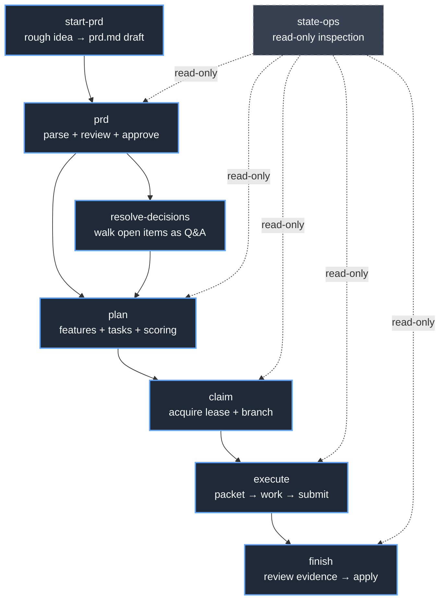

# Skills reference

> **Audience:** users who want to know what each slash-command skill does and when to invoke it.

> anvil ships 8 skills that orchestrate workflows around the CLI. Each
> skill has a trigger phrase (the slash command), a step-by-step procedure,
> and a clear purpose. This reference indexes each skill and names its
> source file.

The skills are pure markdown choreography — they call the CLI, read its
output, and prompt the user one decision at a time. None of them write
directly to `state.db` or `events.jsonl`. See
[`architecture.md` → Component layers](architecture.md#component-layers)
for the architectural placement.

---

## Skill dependency graph

The seven lifecycle skills run in order on the happy path: an idea becomes a
PRD, unresolved `[NEEDS DECISION]` markers and open questions get walked as
Q&A before the task graph is generated, the PRD becomes a task graph, tasks
get claimed and worked, and evidence ships. `state-ops` is the orthogonal
read-only utility — safe to invoke at any point in any session without
changing state.

---

## State-ops

**Trigger:** `/anvil:state-ops`

**Purpose:** Inspect the canonical SQLite state without mutating it. Wraps
`anvil status`, `list`, `show`, `next`, `conflicts`, and `sync`
(reconciliation-only mode).

**When to use:**

- Orienting at the start of any session — run `status` first, always.
- Before claiming a task — confirm the PRD is approved and the task is `ready`.
- When a claim was interrupted and the state of the queue is unclear.
- When multiple agents are active and conflict risk is non-trivial.
- When suspicious that orphan branches or stale packets exist on disk.

**Source:** `skills/state-ops/SKILL.md`

**See also:** [`cli-reference.md`](cli-reference.md) for the underlying CLI
commands, [`mcp.md`](mcp.md) for the equivalent MCP read-only tools.

---

## Start-PRD

**Trigger:** `/anvil:start-prd`

**Purpose:** Turn a rough idea into a structured PRD draft via one-question-
at-a-time Q&A, then write the result to `.anvil/prd.md` so
`anvil prd parse` can consume it. When the user opts into challenge mode, the
skill runs the advisory readiness assessment and asks only the highest-value
missing question at a time. An explicitly autonomous run instead records
bounded, reversible defaults as typed assumptions and continues.

**When to use:**

- The user has an idea ("I want to build a CLI that converts CSV to Parquet")
  but no PRD yet.
- `anvil status` reports `prd-status: none` and the user is not ready
  to write the template by hand.
- A rough scope was discussed in chat and now needs to be captured as a
  structured document.
- The user wants to be challenged on intended behavior, observable outcomes,
  boundaries, or how the work will be verified before design begins.
- The user wants the rest of the workflow to proceed autonomously while every
  inferred premise remains visible and reviewable.

**Source:** `skills/start-prd/SKILL.md`

**See also:** [`how-to/authoring-a-prd.md`](how-to/authoring-a-prd.md) for
the canonical PRD template structure.

---

## PRD

**Trigger:** `/anvil:prd`

**Purpose:** Author, parse, assess, and review the project PRD. The PRD is the
single source of truth for every `Requirement`, `Feature`, and `Task` row
in `state.db`. `anvil prd assess` adds deterministic, advisory feedback and
never changes the existing review gate; nothing can be claimed until the PRD
exists, parses cleanly, and clears that gate.

**When to use:**

- Starting a new project — before any planning, scoring, or task assignment.
- Revising the PRD after stakeholder feedback changes scope or acceptance criteria.
- Recovering after a scope change mid-project — re-anchor what the work is
  before resuming claims.
- Opting into challenge mode to tighten user behavior, outcomes, failure or
  boundary cases, acceptance scenarios, and task verification.
- Continuing autonomously with bounded assumptions documented in the PRD
  instead of silently filling gaps.
- Before any invocation of `/anvil:plan` — planning reads from a
  parsed PRD; authoring must come first.

**Source:** `skills/prd/SKILL.md`

**See also:** [`how-to/authoring-a-prd.md`](how-to/authoring-a-prd.md),
[`prd-template.md`](prd-template.md) for the canonical schema.

---

## Resolve Decisions

**Trigger:** `/anvil:resolve-decisions`

**Purpose:** Walk the PRD's unresolved items — `[NEEDS DECISION]` markers,
`## Open Questions`, and missing acceptance-criteria or verification fields —
as one-question-at-a-time Q&A turns, proposing concrete options when
possible and applying each chosen answer with `anvil prd resolve-decision`.

**When to use:**

- After `anvil prd parse` succeeds and unresolved items remain — the `prd`
  skill routes here when `anvil prd find-decisions` reports non-empty results.
- Before `/anvil:plan` runs, when unresolved decisions would shape task
  generation — the `plan` skill soft-gates into this skill first.
- When the user explicitly asks to "resolve open questions" or "answer the
  NEEDS DECISION items".
- When `anvil review tasks` blocks tasks for missing acceptance criteria or
  verification commands.

**Source:** `skills/resolve-decisions/SKILL.md`

**See also:** [`prd`](#prd) for the upstream parse step that surfaces
decisions, [`plan`](#plan) for the downstream step that consumes a
fully-resolved PRD.

---

## Plan

**Trigger:** `/anvil:plan`

**Purpose:** Convert an approved PRD into a queue of agent-ready tasks.
Drives four sequential state transitions: PRD requirements → features and
tasks → scored tasks → reviewed-and-ready tasks.

**When to use:**

- Immediately after `anvil prd review --approve` — the PRD is
  approved and the task graph does not yet exist.
- After a significant PRD revision that adds new `## Features` or `## Tasks`
  sections — re-plan to generate the updated task graph.
- When `anvil status` shows `prd-status: approved` but
  `ready-tasks: 0` and no tasks exist yet.

**Source:** `skills/plan/SKILL.md`

**See also:** [`cli-reference.md`](cli-reference.md) for the underlying
`plan`, `score`, and `review` commands.

---

## Claim

**Trigger:** `/anvil:claim`

**Purpose:** Acquire an exclusive lease on a `ready` task (240-minute default).
Picks
from the queue, checks for file conflicts, claims the task, and creates the
git branch `agent/<task_id_lower>-<slug>` to commit into.

**When to use:**

- Starting work on a task after `/anvil:plan` has produced a ready queue.
- When resuming after an interrupted session — check `anvil status`
  first, then re-claim if the previous lease has expired and the task
  returned to `ready`.
- When coordinating parallel agents — each agent claims a separate task;
  `claim` enforces the conflict gate.

**Source:** `skills/claim/SKILL.md`

**See also:** [`cli-reference.md`](cli-reference.md) for the underlying
`claim`, `release`, `renew`, and `next` commands.

---

## Execute

**Trigger:** `/anvil:execute`

**Purpose:** Carry a claimed task all the way to `needs_review`: fetch the
work packet, read it in full, do the work, heartbeat the lease, run
verification, and submit evidence.

**When to use:**

- After `anvil claim TASK_ID` has succeeded — claim ID and branch in hand.
- For solo execution: one agent, one task, one branch, straight to submit.

**Source:** `skills/execute/SKILL.md`

**See also:** [`cli-reference.md`](cli-reference.md) for the underlying
`packet`, `progress`, and `submit` commands.

---

## Finish

**Trigger:** `/anvil:finish`

**Purpose:** Drive the final leg of the task lifecycle — read the
evidence, pick a disposition (accept and ship, reject and reopen, hold for
investigation, or discard), call `anvil apply`, and hand off to the
project's git workflow for merging.

**When to use:**

- Tasks appear in `anvil list --status needs_review`.
- Before merging a PR that contains anvil-tracked work — confirm the
  task has been applied first.
- At end-of-day or end-of-iteration when deciding what to ship versus what
  to reopen.

**Source:** `skills/finish/SKILL.md`

**See also:** [`github-sync.md`](github-sync.md) for the optional sync-to-
external-tracker step after `apply --approve`.

---

## See also

- [Architecture: skills layer](architecture.md#component-layers) — where
  skills sit relative to CLI, MCP, and storage.
- [CLI reference](cli-reference.md) — the underlying commands every skill
  wraps.
- [MCP reference](mcp.md) — the equivalent capabilities for non-Claude
  Code MCP clients.
- [Getting started](how-to/getting-started.md) — install + first PRD +
  first claim, using these skills end to end.
